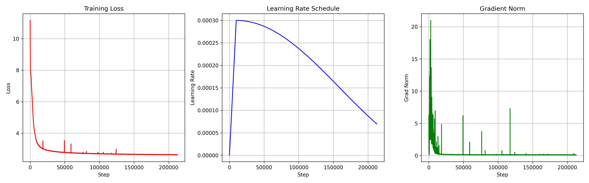
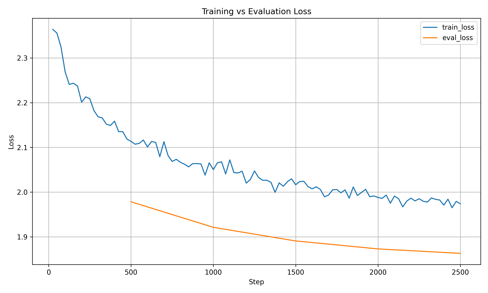

# Model Card

## Overview

This model is a 156M-parameter English-language causal language model trained on a large-scale text corpus and instruction-tuned for general question answering and task completion.

---

## How to run

to run test (simple question answer session on fine-tuned version)
1) download model weights from huggingface (https://huggingface.co/firdavsus/LLM-D2)
2) place weights in fine_tuned_model/ folder
3) run "python3 test.py"
4) just type a queation (if you want to exit type 'stop')

train.py is a training script
fine_tune.py is a fine tuning script
eval.py is a scipt to evaluate raw model using loss on hellaswag

## Model Details

* **Model size:** 156M parameters
* **Architecture:** Transformer (causal LM)
* **Tokenizer:** GPT-2 tokenizer
* **Languages:** English only

---

## Training Curves

## Training Data

### Pretraining

* Dataset: The Pile (10B token subset)
* Domain: mixed-domain text (web, books, articles, code, etc.)

### Instruction Fine-tuning

* Dataset: Alpaca (cleaned subset)
* Size: ~50,000 instruction–response examples
* Formatting: instruction-style prompt/response pairs

---

## Training Setup

### Pretraining

* Steps: **218,000**
* Final training loss: **2.6**

### Post-training (Instruction Fine-tuning)

* Steps: **2,500**
* Final training loss: **1.9**

---

## Evaluation

| Benchmark | Score    |
| --------- | -------- |
| HellaSwag | **28.5** |

---

## Intended Use

* Instruction-style prompting
* Basic question answering
* Text generation and summarization
* Lightweight assistant-style tasks (English)

---

## Limitations

* Small model size limits reasoning and factual reliability
* May produce incorrect or inconsistent answers
* Instruction-following quality depends strongly on prompt format
* Not suitable for high-stakes or safety-critical use

---
license: mit
---

# This model has not been safety-aligned. Please apply your own moderation and guardrails when deploying it ;)
FOR ADDITIONAL INFO CHEKC INFO.TXT (with input and ouput examples)
